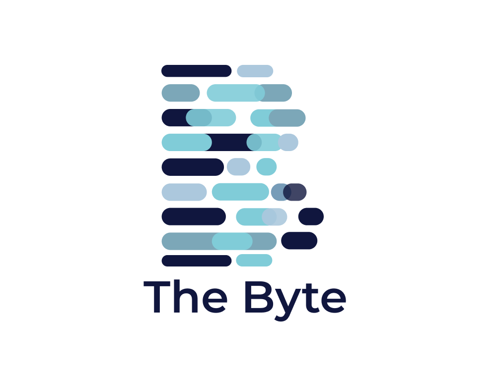

# Team 8 - CSE 110
## Original Project by Team Byte (Group 8 - CSE 110 Fall 22')



[](https://github.com/cse110-fa22-group8/cse110-fa22-group8/actions/workflows/html-validation.yml)
[](https://github.com/cse110-fa22-group8/cse110-fa22-group8/actions/workflows/jsdocs.yml)
[](https://github.com/cse110-fa22-group8/cse110-fa22-group8/actions/workflows/linter.yml)
[](https://github.com/cse110-fa22-group8/cse110-fa22-group8/actions/workflows/prettier.yml)
[](https://github.com/cse110-fa22-group8/cse110-fa22-group8/actions/workflows/unit_test.yml)

Check out our [Team Page](admin/team.md)!

This project is a Expense Tracker to help others manage their expenses and
stay financially responsible. Unlike many other expense trackers, our expense tracker provides features like:
- Login security preventing unauthorized access to local accounts
- Categorized Expenses for organized displays
- Expense Breakdowns categorizing the expense from needs, wants, and savings

To see the live project, visit [Frugal](https://cse110-fa22-group8.github.io/cse110-fa22-group8/source/main/login_page/login_page.html).
- [Public Video](https://www.youtube.com/watch?v=JglN2eMawa4)
- [Private Video]()

## Frugal Overview 
**How to stay financially responsible** 
- Create an account and Login to get started.
- Once in the home page you will be able to add expenses by clicking on the "add new expense" button. 
  - You will then fill out the pop up form with the name of your expense, price, category (needs, wants, and savings), and date. 
  - You will have the ability to edit or delete each expense by clicking on the three horizontal dots to the right of the expense row. 
- To view your expense breakdown, click the pie chart next to the "add expense button".
  - A pop up form breaking down your expense via a pie chart will be shown on your screen. 
- Using the search bar feature, you can search for a specific expense by typing your expense name in the search bar. 
- You can also filter out expense categories to calculate how much was spent in each category. 
- All your information will be stored onto your local storage and associated with your username.

## Source Documentation (JSDocs)

[JS Documentation](https://dolphin-app-cfpne.ondigitalocean.app/)

JSDocs for main are automatically generated to the link above or [here](https://dolphin-app-cfpne.ondigitalocean.app/).
  

## Installing dependencies
Our development dependencies are managed by npm. To install, run:
```
$ npm install
```

## Testing
- To run unit tests, run Jest in the project directory:
```
$ npm run test
```
## Develop locally
Clone this repo to your local machine. For any new feature request, create an issue outlining the constraints and plan of implementation. Open a branch named from that issue/feature request and make any changes required. If using VSCode, download the live server extension and see your changes visually by right-clicking on the corresponding HTML file and starting a live server. If everything looks correct and all the unit tests pass, submit a pull request for the branch, linking it to the created issue. Two approving reviews by other developers will be required before the branch is merged into main. 


